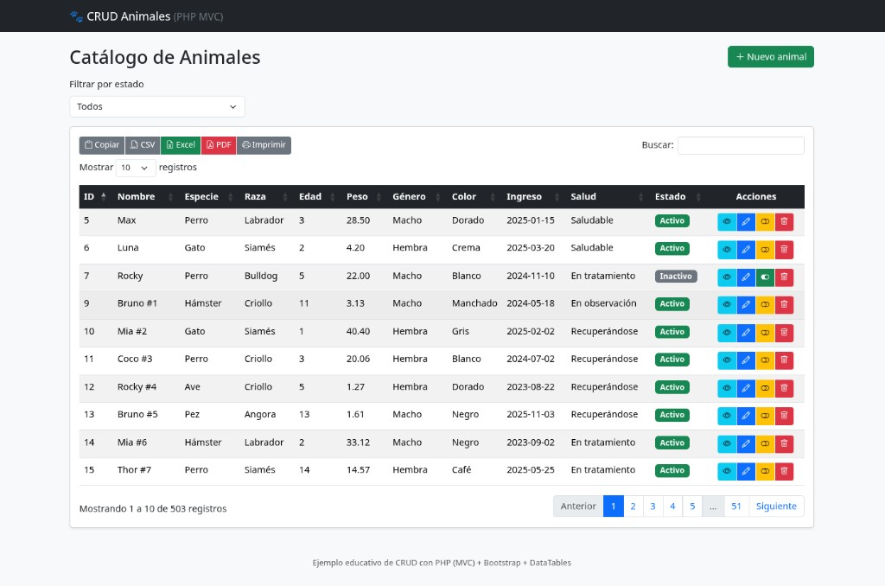

# CRUD de ejemplo — PHP (MVC) + Bootstrap + DataTables

Ejemplo **educativo** de un CRUD limpio y ordenado, pensado para que alguien que está empezando lo entienda fácil.

A diferencia del proyecto original (todo el PHP, HTML, CSS y SQL mezclado en un solo archivo), aquí cada cosa está **separada en su lugar**:

- **PHP** → lógica (modelo y controlador)
- **HTML** → diseño, con variables `{{nombre}}` que el PHP reemplaza
- **CSS** → estilos
- **JavaScript** → comportamiento de la tabla

Usa la **misma base de datos y tabla** del proyecto original (`catalogo_animales` / `animales`).

## Vista previa



El listado muestra paginación, buscador, filtro por estado y, en cada fila,
los botones de consultar, editar, activar/desactivar y eliminar.

---

## ¿Qué es MVC? (en una frase)

Es separar el código en 3 capas para no hacer un "todo junto":

| Capa | Carpeta | Responsabilidad | Analogía (restaurante) |
|------|---------|-----------------|------------------------|
| **Modelo** | `app/models/` | Hablar con la base de datos | La cocina |
| **Vista** | `app/views/` | Mostrar el HTML al usuario | El plato servido |
| **Controlador** | `app/controllers/` | Coordinar entre vista y modelo | El mesero |

---

## Estructura de carpetas

```
crud-example/
├── config/
│   └── config.php              # Datos de conexión a la BD
├── app/
│   ├── core/
│   │   ├── Database.php        # Conexión PDO a MySQL
│   │   └── View.php            # Motor de plantillas ({{variables}})
│   ├── models/
│   │   └── AnimalModel.php     # TODAS las consultas SQL
│   ├── controllers/
│   │   └── AnimalController.php # Una función = una acción/pantalla
│   └── views/
│       ├── partials/
│       │   ├── header.html     # Cabecera común (CSS, navbar)
│       │   └── footer.html     # Pie común (scripts)
│       ├── lista.html          # Listado (DataTable)
│       └── formulario.html     # Registrar / Consultar / Editar (un solo HTML)
├── public/                     # Lo único que ve el navegador
│   ├── index.php               # Puerta de entrada (enrutador)
│   ├── .htaccess
│   ├── css/estilos.css
│   ├── js/animales.js          # DataTables + botones de acciones
│   └── vendor/                 # Bootstrap, jQuery y DataTables LOCALES (sin internet)
├── sql/
│   └── animales.sql            # Agrega la columna "activo"
└── deploy.sh                   # Script para publicarlo en Apache
```

---

## ¿Cómo fluye una petición? (ejemplo: ver el listado)

```
Navegador  →  public/index.php?action=index
                     │
                     ▼
          AnimalController->index()
                     │
                     ▼
          View::render('lista')  →  HTML al navegador
                     │
                     ▼
   js/animales.js pide los datos a index.php?action=datos
                     │
                     ▼
   AnimalController->datos()  →  AnimalModel->todos()  →  JSON
                     │
                     ▼
        DataTables pinta la tabla (con paginación y buscador)
```

---

## Las acciones (cada una es una "vista" / pantalla)

Todo pasa por `index.php?action=...`:

| Acción | Qué hace |
|--------|----------|
| `index` | Muestra el listado con DataTable |
| `datos` | Devuelve los animales en JSON (lo usa DataTables) |
| `crear` | Formulario **vacío** para registrar |
| `ver` | Formulario **lleno y bloqueado** (solo consultar) |
| `editar` | Formulario **lleno y editable** |
| `guardar` | Inserta el nuevo registro |
| `actualizar` | Guarda los cambios |
| `estado` | Activa / desactiva (campo `activo`) |
| `eliminar` | Borra el registro de forma permanente |

El **mismo** `formulario.html` sirve para registrar, consultar y editar.
El controlador solo cambia las variables (título, valores, si está bloqueado, etc.).

---

## La tabla (DataTables)

DataTables nos da **gratis**: paginación, buscador y ordenar por columnas.
Solo le decimos de dónde sacar los datos (`?action=datos`) y cómo pintar los botones.

Columna de **Acciones** por cada fila:

- 🔵 **Consultar** (ojo) — ver sin editar
- 🟦 **Editar** (lápiz)
- 🟡/🟢 **Desactivar / Activar** (interruptor) — cambia el estado en la BD
- 🔴 **Eliminar** (papelera) — borrado físico (pide confirmación)

Arriba hay un **droplist** para filtrar: Todos / Solo activos / Solo inactivos.

### Exportar / generar reportes

Encima de la tabla hay botones para exportar los registros (sin la columna de Acciones):

- **Copiar** — al portapapeles
- **CSV** — archivo `.csv`
- **Excel** — archivo `.xlsx`
- **PDF** — reporte en PDF (horizontal)
- **Imprimir** — vista lista para impresora

Funciona **sin internet**: las librerías de exportación (Buttons, JSZip para Excel
y pdfMake para PDF) están en `public/vendor/datatables-buttons/`.

---

## Cómo ejecutarlo

### Opción A — Script automático (recomendado)

Si ya tienes Apache + PHP + MariaDB corriendo:

```bash
# Entra a la carpeta donde clonaste el repositorio
cd crud-example
sudo bash deploy.sh
```

Abre: **http://localhost/crud-example/public/**

### Opción B — Manual (Linux)

```bash
# 1. Agregar la columna "activo" a la tabla
sudo mariadb -u root < sql/animales.sql

# 2. Copiar a Apache (ejecuta esto desde dentro de la carpeta del proyecto)
sudo cp -a . /var/www/html/crud-example
sudo chown -R www-data:www-data /var/www/html/crud-example
```

Abre: **http://localhost/crud-example/public/**

### Opción C — Windows (XAMPP)

El proyecto funciona igual en Windows. El script `deploy.sh` es solo para Linux,
en Windows se hace a mano (es muy fácil):

1. Copia la carpeta del proyecto a `C:\xampp\htdocs\crud-example`
2. Abre el panel de XAMPP y enciende **Apache** y **MySQL**
3. Entra a `http://localhost/phpmyadmin` e **importa** el archivo `sql/animales.sql`
   (o pega su contenido en la pestaña SQL)
4. Abre: **http://localhost/crud-example/public/**

> No hay que cambiar nada de código entre Linux y Windows: las rutas internas
> son relativas o calculadas, y la conexión usa los mismos datos por defecto
> (usuario `root`, sin contraseña).

---

## Seguridad (qué se mejoró respecto al original)

- ✅ **Prepared statements** en todas las consultas (sin inyección SQL).
- ✅ `htmlspecialchars()` al mostrar datos (sin inyección de HTML/JS).
- ✅ **Lista blanca** de acciones en el enrutador (no se llaman métodos arbitrarios).
- ✅ Credenciales en un solo archivo (`config/config.php`).

> Nota: sigue siendo un ejemplo local. Para producción habría que añadir
> autenticación, validación más estricta y tokens CSRF.

---

## Funciona sin internet (offline)

Todas las librerías (Bootstrap, Bootstrap Icons, jQuery, DataTables y la
traducción al español) están **descargadas** dentro de `public/vendor/`.
No se usa ningún CDN, así que la aplicación funciona aunque no haya conexión.

```
public/vendor/
├── bootstrap/          # bootstrap.min.css + bootstrap.bundle.min.js
├── bootstrap-icons/    # CSS + fuentes (woff/woff2)
├── datatables/         # CSS, JS y traducción es-ES.json
└── jquery/             # jquery-3.7.1.min.js
```

Si algún día quieres actualizar una librería, solo reemplazas el archivo
correspondiente dentro de `public/vendor/`.

---

## Portabilidad (Linux, Windows, Mac)

El proyecto está pensado para correr en cualquier equipo sin cambios:

- **Rutas de archivos PHP**: se calculan con `__DIR__` (ruta del propio archivo).
  PHP acepta `/` también en Windows, así que `__DIR__ . '/../views/'` funciona
  en los tres sistemas. No hay rutas absolutas tipo `/var/www` ni `C:\` en el código.
- **Rutas de la web (CSS, JS, enlaces)**: son **relativas** (`vendor/...`,
  `index.php?action=...`), así que funcionan sin importar en qué carpeta se publique.
- **Finales de línea**: `.gitattributes` fuerza **LF** en los archivos de texto y
  marca las fuentes como **binarias**, para que nada se corrompa al pasar de un SO a otro.
- **Mayúsculas/minúsculas**: Linux distingue mayúsculas en los nombres de archivo
  (Windows no). Los nombres están escritos siempre igual en el código y en el disco,
  así que no hay sorpresas al mover el proyecto de Windows a Linux.
- **`.editorconfig`**: mantiene el mismo formato (UTF-8, LF, indentación) en cualquier editor.

> Lo único específico de cada sistema es **cómo se publica**: en Linux con `deploy.sh`
> (o copiando a `/var/www/html`), y en Windows copiando a `C:\xampp\htdocs`.
